# Good2Go

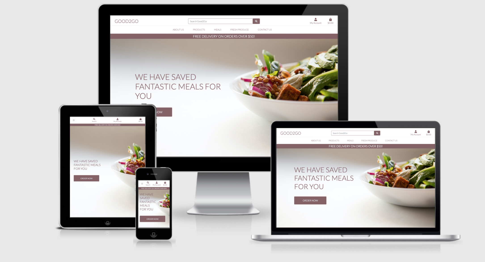

The live website can be found [Good2Go](https://goodtogo1.herokuapp.com/).

# Contents
1. [About the Site](##About-the-Site)
2. [Strategy Plane](##Strategy-Plane)
    - User Stories 
3. [Scope Plane](##Scope-Plane)
    - Features Planned
    - Features and Django Apps
    - Additional Functionality
4. [Structure Plane](##Structure-Plane)
    - Database Design
5. [Skeleton Plane](##Skeleton-Plane)
6. [Surface Plane](##Surface-Plane)
7. [Design](##Design)
8. [Technologies Used](##Technologies-Used)
9. [Testing](##Testing)
10. [Deployment](##Deployment)
11. [In Progress](##In-Progress)
12. [Credit](##Credit)

## About the Site: 

The Good2Go site has been designed in the scope of the Code Institute Full Stack Frameworks with Django Project to give users a seamless way to view, select, and order meals and produce at a discounted rate. All the items present on the site have been saved from disposal. The user will have limited access to the site without registering an account, but will have full view of the meal and produce items. The idea of the site is to make all the content relevant to sustainability, easy accessibility and great experience. 

## Strategy Plane

The GoodtoGo site is an ecommerce platform created to showcase knowledge gained throughout the Full Stack course. The project aims to provide an exciting user experience for those interested in ordering meals that have been rescued. Users can successfully purchase items, and have them delivered to their home. For more user interaction a blog was created and a review section was added. Users are encouraged to reach out to GoodtoGo through a contact form. The site was inspired by the UK company Too Good Too Go.

User Stories: 

As an e-commerce site owner I would like to …
- Have access to site super user and admin to view and maintain site 
- View products, transaction, reviews and identify any inconsistencies 
- Add products and new items to my store
- Edit/ Delete products in my store
- Accept and/or reject reviews from customers
- Add/ Edit/ Delete Blog posts 

As a shopper I would like to …
- View products in distinct categories
- View product details of the products selected 
- Easily add products/ items to my bag
- View products in bad and the total easily
- Register for a site account 
- Receive a confirmation email after registering 
- Easily log in and logout
- View my personalised user account
- Sort through available products by category, price etc…
- Search for product by name 
- Easily select the portion size and quantity of a product when purchasing 
- Simply add payment information safely and securely 
- View an order confirmation after checkout
- Receive an email confirmation after checking out 

## Scope Plane 
In designing GoodtoGo, the idea was for the user to have a positive and easy experience through a simple and usable web-site. The user is able to navigate through the navigation bar that is always visible and by links in the footer. They can go from any part of the web-site to any other part. Simple to navigate and intuitive.

### Features Planned

The GoodtoGo site was developed with dynamic products including appropriate restrictions. Features like create, read, update, and delete, are available for admins and shop users, which users are able to edit reviews made once they sign up.

-	Responsive Design – site should function on mobile, tablet and desktop/laptop devices
-	Navigation across all pages
-	Clearly display information on website which is supplemented by entering the About Us page.
-	A standard e-commerce feed for products with the option to search, sort products and filter them by category name.
-	Every product can be added to the cart immediately and links to a product detail page where the user can read more about it.
-	About Us page informs the user of information about the company owners and informational blogs for their education.
-	Blog page containing blog posts all bout sustainability and the process of saving meals.
-	Contact information and form to easily contact the store.
-	Options for the customers to leave a review on a product.
- Footer Section

### Features and Django Apps

GoodtoGo is a Django project that consists of 8 Django applications, they are all listed below. As explained in Django's documentation - a Django application describes a Python package that provides some set of features. Applications may be reused in various projects.
* `about`
* `bag`
* `blog`
* `checkout`
* `contact`
* `home`
* `products`
* `profiles`
* `reviews`

### Additional functionality:
-	Search functionality: Search box at the top of the nav bar which is accessible across all pages on mobile this is found in the collapsible under the search symbol
-	Toasts: Small snippet messages for success, info, warning and error.
-	Django- all auth: Python package addressing authentication of user, it allows for features such as signup logout and password change. 

## Structure Plane

The website will have a few pages accessible to a non-registered user and additional 2 pages that will be accessible only after registration. There are a total of 5 page to navigate to and an additional shopping bag and my account section for users registered:

-	Home: Provides a simple landing page for users to get the look and feel of Good2Go before navigating to other pages.
-	About us: Provides the user with information about Good2Go and context for their use of the site. Additionally, the Good2Go blog is accessible on the about us page. 
-	Products: User can view all products available for order and sort through them through specific filters.
-	Meals: User can search through available meals on the site for ordering. 
-	Fresh Produce: User can search through available fresh produce on the site for ordering.
-	Contact us: User can see location and address of GoodtoGo additionally they can contact the company through a contact form.  
-	My Account: User can view profile, log in and out or manage products if they are an admin. 
-	Shopping bag: User can view items in shopping bag, checkout and pay for their items as well as input address for delivery. 

The pages consist of different sections unique to their functionality. A navigation bar which will be adapted accordingly for the mobile version, will be static on the top of the website. This will allow the user to move to any other section easily without scrolling or searching for the navigation. 

### Database Design

#### Profiles App

| Name | Database Key | Field Type | Type Validation |
| :-------------: |:----------------:| :--------------: | :---------: |
|User | user |	OneToOneField 'User'| on_delete=models.CASCADE
|Default Phone Number |	default_phone_number | CharField | max_length=20, null=True, blank=True
|Default Country | default_country | CountryField | blank_label='country', null=True, blank=True
|Default Postcode | default_postcode | CharField | max_length=20, null=True, blank=True
|Default Town or City | default_town_or_city | CharField | max_length=40, null=True, blank=True
|Default Street Address1 | default_street_address1 | CharField | max_length=80, null=True, blank=True
|Default Street Address2 | default_street_address2 | CharField | max_length=80, null=True, blank=True

#### Products App

`Category` model

| Name | Database Key | Field Type | Type Validation |
| :-------------: |:----------------:| :--------------: | :---------: |
|Name | name | CharField | max_length=254
|Friendly Name | friendly_name | CharField | max_length=254, null=True, blank=True

`Product` model

| Name | Database Key | Validation | Field Type|
| :-------------: |:----------------:| :--------------: | :---------: |
|Product id | id | primary_key=True | AutoField
|Name | name | default='', max_length=254 | CharField
|SKU | sku | max_length=254, null=True, blank=True | CharField
|Description | content | blank=False | TextField
|Price | price | max_digits=6, decimal_places=2 | DecimalField
|Image| image| blank=False | ImageField
|Rating | rating | blank=True | DecimalField

#### Review

| Name | Database Key | Validation | Field Type|
| :-------------: |:----------------:| :--------------: | :---------: |
|User | user | on_delete=models.CASCADE | ForeignKey
|Product| product | Product, related_name="review" | ForeignKey
|Title | title | max_length=50 | CharField
|Description| description | description | TextField
|Rating | rating | choices=RATE | IntegerField
|Upvotes | upvotes | default=0 | IntegerField
|Downvotes| downvotes | default=0 | IntegerField
|date_posted | date_posted | auto_now_add=True| DateTimeField

## Skeleton Plane 
The Goodtogo website will have a consistent colour pallet consisting of greys and maroons., this will include consistent typography, sizing, colour and look/feel.

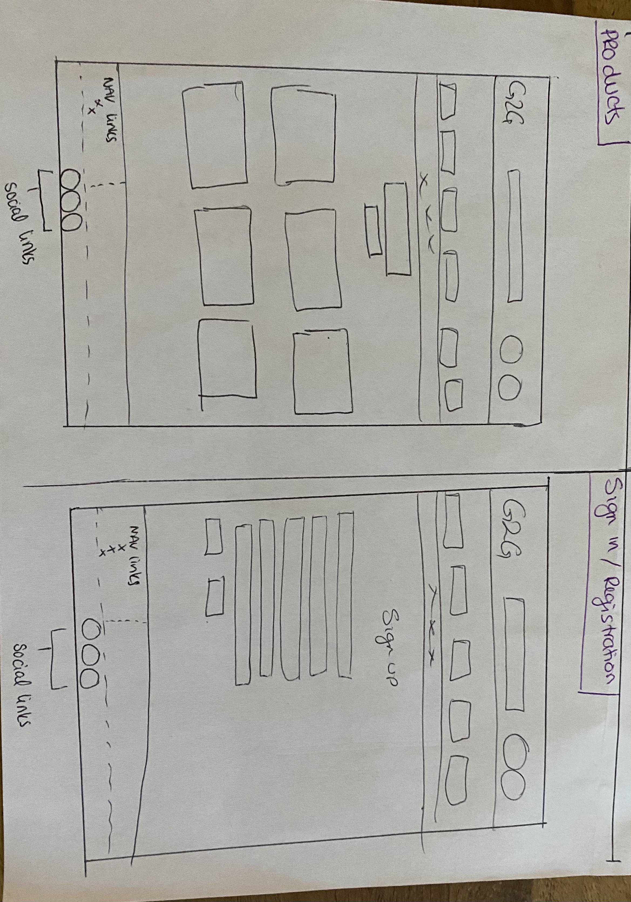
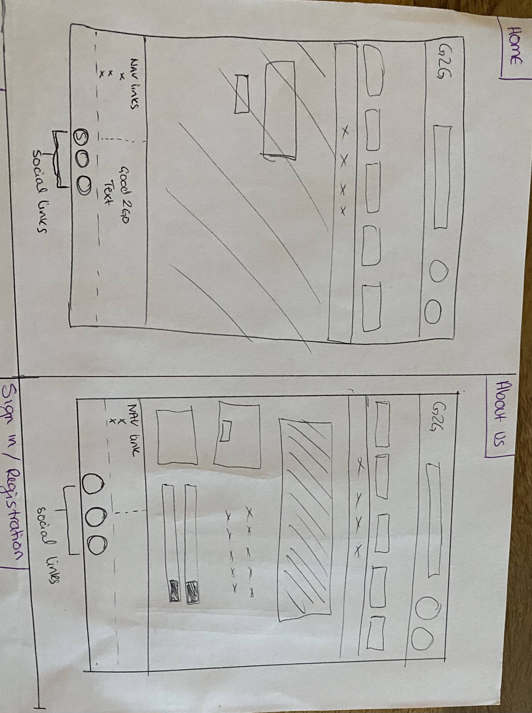

## Technologies Used

### Programming languages
-	HTML - the project used HTML to define structure and layout of the web page;
-	CSS - the project used CSS stylesheets to specify style of the web document elements;
-	JavaScript - the project used JavaScript to implement Stripe, EmailJS and custom Javascript.
-	Python - the project back-end functions are written using Python.
Libraries
-	Font Awesome - Font Awesome icons were used throughout the web-site.
-	jQuery - is a JavaScript library designed to simplify HTML DOM tree traversal and manipulation.
Frameworks & Extensions
-	Django – Django is a high-level Python Web framework that encourages rapid development and clean, pragmatic design.
-	Bootstrap – Bootstrap is a web framework that focuses on simplifying the development of informative web pages.
-	EmailJS – Service that helps sending emails using client side technologies only. It only requires to connect EmailJS to one of the supported email services, create an email template, and use their Javascript library to trigger an email.
-	Stripe – Allows individuals and businesses to make and receive payments over the Internet.
Database
-	Heroku Postgres – PostgreSQL is one of the world's most popular relational database management systems.
Others
-	GitHub - GitHub is a global company that provides hosting for software development version control using Git.
-	Gitpod - One-click ready-to-code development environments for GitHub.
-	Heroku - Heroku is a cloud platform that lets companies build, deliver, monitor and scale apps.
-	AWS-S3 – Object storage service that offers industry-leading scalability, data availability, security, and performance.

## Surface Plane 

As an e-commerce site owner I would like to …

-	Have access to site super user and admin to view and maintain site 
    - User is able to: log into admin and super user and apply CRUD functionality to Products. Blogs and Reviews.
-	View products, transaction, reviews and identify any inconsistencies
    - User is able to: view products, transactions and details through the admin portal to identify any issues or inconsistencies that arise. 
-	Add products and new items to my store
    - User is able to: Navigate to the product management section of the site and add new products as stock comes in. 
-	Edit/ Delete products in my store
    - User is able to: Navigate to the product management section of the site and Edit or Delete products as stock depletes or prices drop. 
-	Accept and/or reject reviews from customers
    - User is able to: Utilize the admin site to review and take action on reviews left by customer. This is a safely tool allowing the owner to product the site integrity.
-	Add/ Delete Blog posts:
    - User is able to: Utilize the admin site to add and delete blog posts as the content is created. This allows the owner to ensure all content on the blog content is up to date. 

As a shopper I would like to …

-	View products in distinct categories
    - User is able to: navigate to the products section, meals section and fresh produce sections, viewing products that fit within that category. 
-	View product details of the products selected 
    - User is able to: Click on a specific product and be navigated to a product detail page where they are provided with all details about the product
-	Easily add products/ items to my bag
    - User is able to: Click on an item and find a “Add to Bag” button which will easily add the item to the bag. 
-	View products in bag and the grand total easily
    - User is able to: View bag summary from home page as they add items into the bag. Furthermore, when they click on the bag they are able to see a full breakdown of items in the bag. 
-	Register for a site account 
    - User is able to: Navigate to account icon and select register, where they are able to fill in a registration form. 
-	Receive a confirmation email after registering 
    - User is able to: Check sign up email and receive a confirmation code
-	Easily log in and logout
    - User is able to: Navigate to account icon and select login, where they are able to fill in details for logging in or easily log out.
-	View my personalised user account
    - User is able to: Navigate to account icon and select my profile.
-	Sort through available products by category, price etc…
    - User is able to: Click on the Product button on the nav bar, and is presented with options to sort items.
-	Search for product by name 
    - User is able to: Utilize a search bar that is present at the top of the page. 
-	Simply add payment information safely and securely 
    - User is able to: Add payment details and verify if details are correct when submitting 
-	View an order confirmation after checkout
    - User is able to: view full checkout order prior to confirmation
- Receive an email confirmation after checking out
    - User is able to: recieve emails when checking out

## Testing
### Validating Code
- HTML code is validated through [W3 validator](https://validator.w3.org/).
    - Error in list (li) and (a) elements (Fixed)
    - Error on (a) attribute is intended to be fixed but project ran out of time to address these, as the code is functioning correctly the decision was made to complete larger functions. 
- CSS code is validated through [W3 Jigsaw](https://jigsaw.w3.org/css-validator/).
    - Error in Value for background color (Fixed)
    - Bootstrap Errors identified and left 
- JavaScript code is validated through [JS Hint](https://jshint.com/).
    - Unidentified variables found, however expected so remain unchanged 
    - Issues found to do with version of server version, not a concern at this point

- Flake8

A number of issues were identified and rectified utilizing Flake8, it was also chosen to not address a number of identified issues as they were not detrimental to the project as a whole. 

### Testing interaction:

Not signed in:

Home Page:
-	Opening the site in full screen expecting to see all images, buttons, and labels displaying correctly.
-	Click Shop Now expecting to go to products page 
-	Clicking on user icon expecting it to redirect to register page correctly.
-	Clicking on user icon expecting it to redirect to sign in page correctly.
-	Clicking products, meals and fresh produce and expecting to be directed correctly. 
-	Clicking social links expecting to be directed to expected external link on a separate tab.

About us:
-	Opening the site in full screen expecting to see all images, buttons, and labels displaying correctly.
-	Click Shop Now expecting to go to products page.
-	Clicking products, meals and fresh produce and expecting to be directed correctly. 
-	Scrolling down expecting to view blog posts. 
-	Clicking on Read More expecting to be redirected to view with full blog piece.

Sign in/Register Page:

-	Attempted to input username only and click log in, asked for password.
-	Typed in username and wrong password, received expected feedback, and log in not processed.
-	Inputted password only, and no username, was informed to input in username.
-	Inputted in correct username and correct password, website allowed me to sign in.
-	When logged in successfully, expecting the page to redirect user to my recipes page.

Signed in:

1.	Home Page:
    - Unchanged from not logged in
2.	About Us:
    - Unchanged from not logged in
3.	My Profile
    - Updated information for delivery successfully 
4.	Checkout bag
    - Add item to bag, adds items to shopping bag
    - Increase or Decrease buttons accordingly amend the quantities in the bag
    - Remove and update buttons tested and effectively implement changes
    - “Keep Shopping” button redirects to products as expected
    - “Secure Checkout” expectedly redirects to checkout form
    - Input details in form, tested wrong and correct card numbers and receive error and success accordingly 
    - Submit form expectedly displays Stripe Payment modal

Issues Found:

A number of issues were found with the styling and sizing of elements throughout the site. The most notable were the map sizing and the broken product images.

1.	Map Sizing 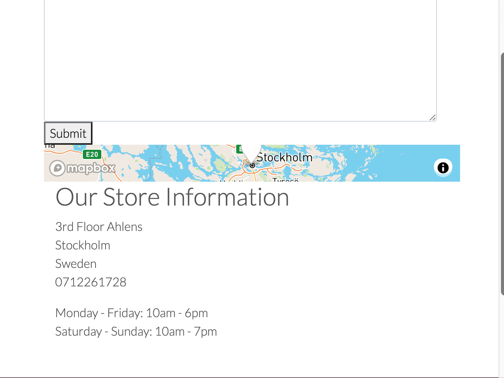
The Map was rendering incorrectly on the page and when the screen size was reduced the map did not keep its height. To rectify this bootstrap columns were utilized as well as css styling. 
2.  Broken Prouduct link 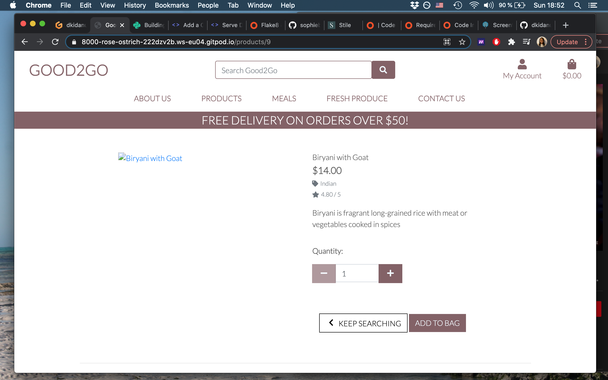
Image was updated in admin console 
3. Broken Prouct link 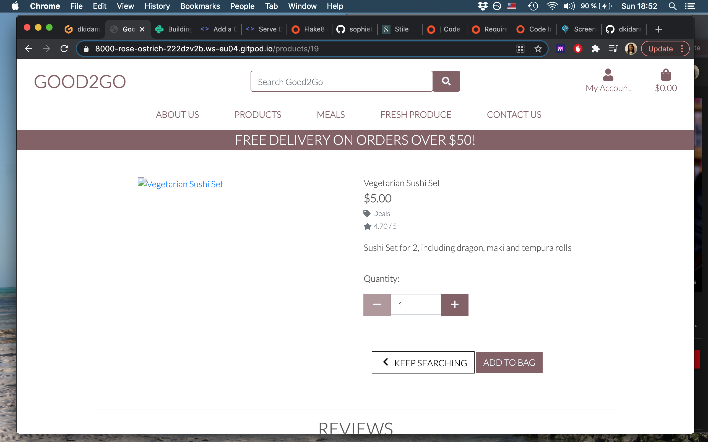
Image was updated in admin console 
4. Review 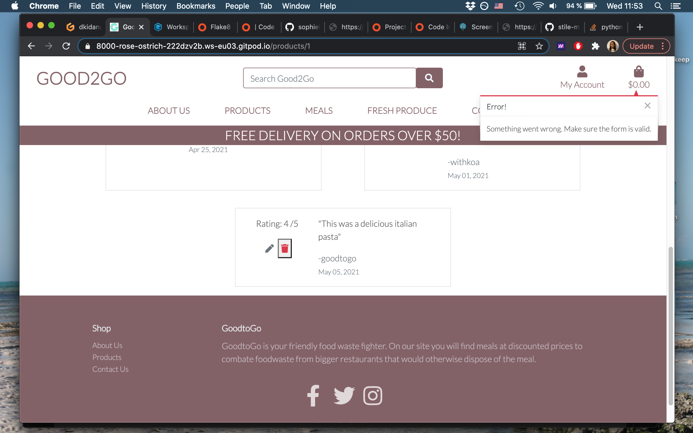
A logic error was found when attempting to edit the reviews. To fix this the model logic was reviewed and edit html render page changed. 
5. Contact us: 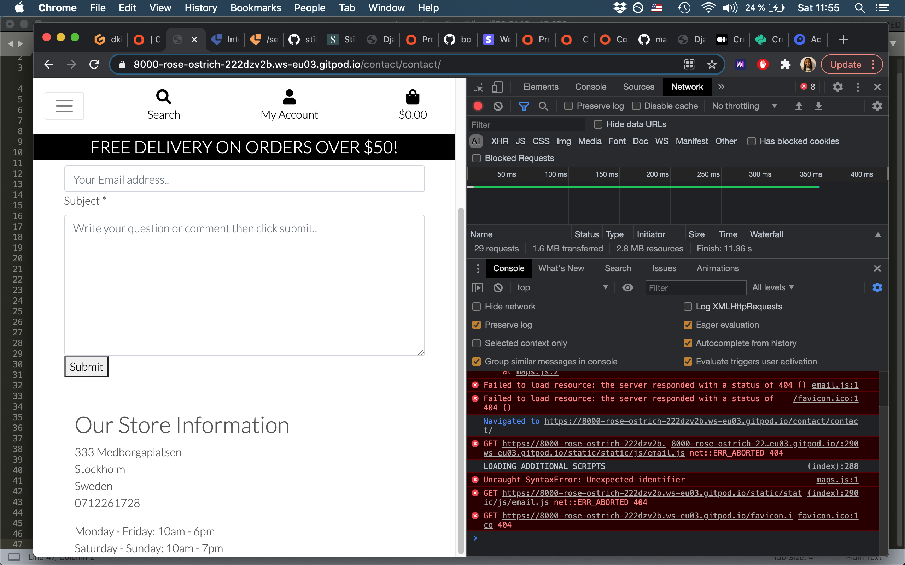
A number of console errors were found in the page. These were identified and solved one by one.

Console Issues

1. Favicon 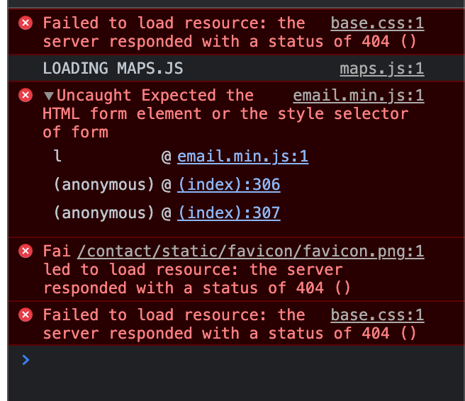
The console threw errors identifying that the Favicon could not be reached. The issue here was that the image was hard coded and not input as a URL. 
2. Contact Us 
The contact form had an error that identified an extra line of code that was not necessary for the script to work. This function was calling itself and thew an error.
3. Logs 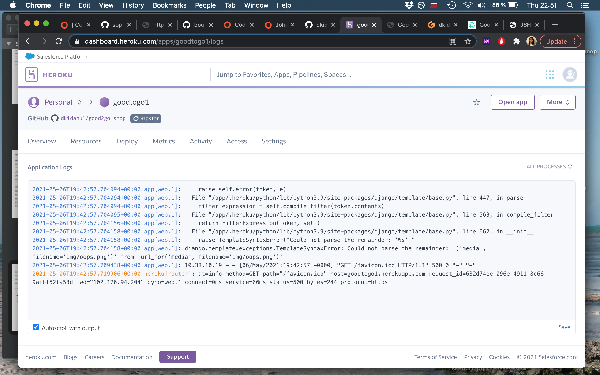
When deploying the project to Heroku, it became clear that there were a number of issues in the deployment, i.e. the about us page was not linkedup correctly, the images were hard coded instead of URLs utilized and console errors affected the deployment. 
4. Review 
There was a logical error in the review section, when an edit was made and saved an error was thrown. The code was calling an undefined element. 
5. Stripe Checkout: "unsupported operand type(s) for +: 'decimal.Decimal' and 'float'" there was an error of mismatch between decimal and float to fix this I transformed the decimals into floats to be consistent.

Linking:

During the development of the Django project it became evident that various links and navigations were faulty through the site. The ones identified are below 
1.	Add Review: here there was a broken link stemming from a naming issue in the models.py 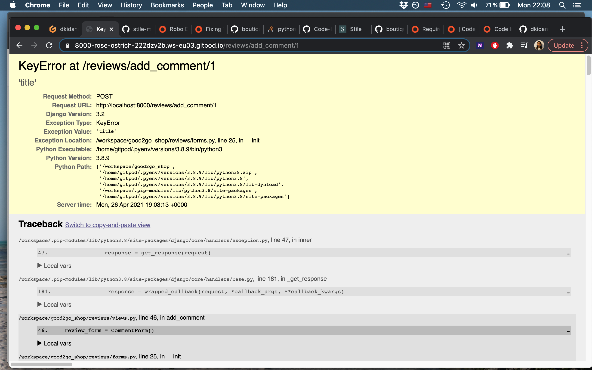
2.	Edit Review: here there was 1 required positional argument missing in the code. 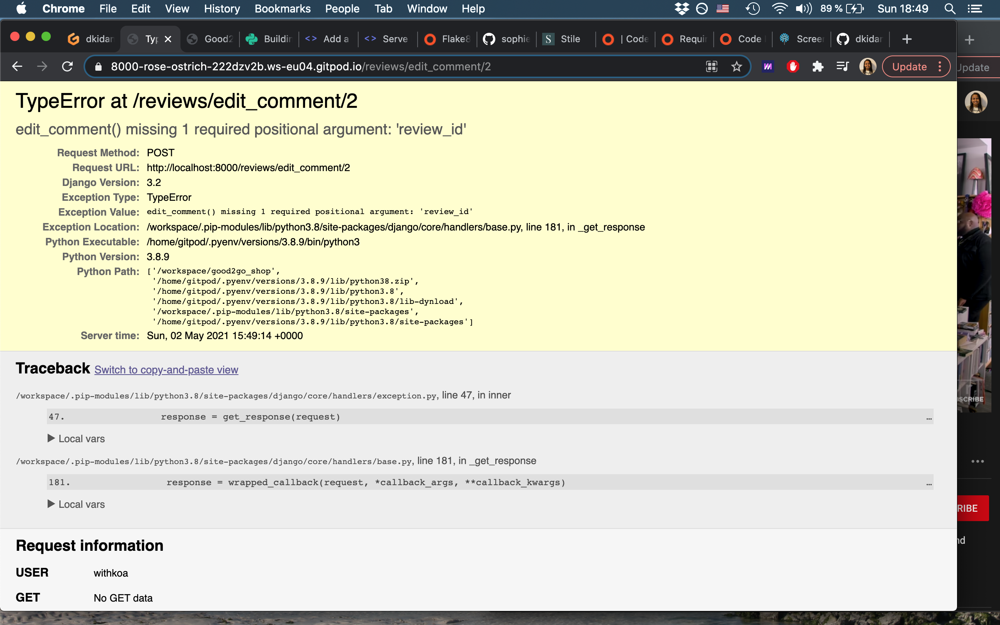
3.	Blog View: The link to allow the user to read more and view entire blog posts was broken. 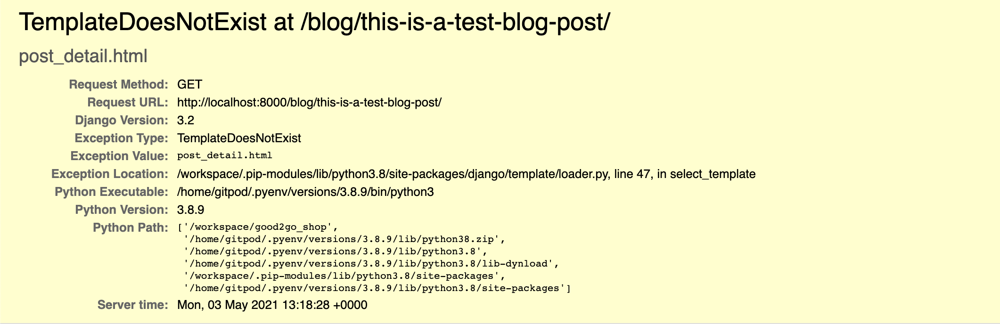 
4. Text area input for the reviews was not able to access the value attribute. This was changed to an input. 

### Navigation

| Functionality | Expected Outcome | Actual Outcome | Pass/Fail |
| :-------------: |:----------------:| :--------------: | :---------: |
| Clicking on G2G Logo  | Opens "About Us" page | As Expected | Pass |
| Clicking on `Product` link | Opens dropdown tab with links | As expected | Pass |
| Clicking on `Meals and Fresh Produce` link | Opens dropdown tab with links | As expected | Pass |
| Clicking on `My Account` link | Opens dropdown tab with links for Log In | As expected | Pass |
| Clicking on `Register` link | Opens Register page | As expected | Pass |
| Clicking on `my account` link | Opens dropdown tab with links | As expected | Pass |
| Clicking on `log Out` link | Logs out user and redirects to log in page | As expected | Pass |

### Footer

| Functionality | Expected Outcome | Actual Outcome | Pass/Fail |
| :-------------: |:----------------:| :--------------: | :---------: |
| Clicking on `Facebook` icon | Opens Facebook website in new tab | As expected | Pass |
| Clicking on `Instagram` icon | Opens Instagram website in new tab | As expected | Pass |
| Clicking on `Twitter` icon | Opens Twitter website in new tab | As expected | Pass |
| Clicking on nav menu links | Opens the appropriate web page | As expected | Pass |

## About us

| Functionality | Expected Outcome | Actual Outcome | Pass/Fail |
| :-------------: |:----------------:| :--------------: | :---------: |
| Clicking on `Read more` blog button | Opens the full blog post on new page | As expected | Pass |

## Product

| Functionality | Expected Outcome | Actual Outcome | Pass/Fail |
| :-------------: |:----------------:| :--------------: | :---------: |
| Clicking on product cards | Opens the selected product detail | As expected | Pass |
| Clicking on `Add to Bag` button | Opens the products page | As expected | Pass |
| Clicking on `Email` icon | Opens email modal to contact site owner | As expected | Pass |
| Clicking on filter button | Show products under that category | As Expected | Pass
| Clicking on product | Show product details info on a new page | As Expected | Pass
| Selecting the number in input and clicking "Add" | Adds the selected quantity of the item to cart and then opens "View Bag" page |As Expected | Pass

### Reviews

| Functionality | Expected Outcome | Actual Outcome | Pass/Fail |
| :-------------: |:----------------:| :--------------: | :---------: |
| Clicking on `Submit` button without filling all the forms | Displays Validation to tell the user to enter all the forms | As Expected | Pass |
| After clicking on `Add` button | User is redirected to "Products" page with their review now sucessfully showing | As Expected | Pass |
| Clicking on `Edit` symbol | User is redirected to "Edit your review" modal with previous information showing | As Expected | Pass |
| Clicking on `Delete` symbol | user is directed to modal to delete their review | As Expected | Pass |

### Registration

| Functionality | Expected Outcome | Actual Outcome | Pass/Fail |
| :-------------: |:----------------:| :--------------: | :---------: |
| Clicking on Register button | Registers the user and redirects to confirm email address. If registration form is incomplete, shows Please fill out this field | As Expected | Pass

### Sign in

| Functionality | Expected Outcome | Actual Outcome | Pass/Fail |
| :-------------: |:----------------:| :--------------: | :---------: |
| Clicking on `Log In` with correct username and password | Directs user to the index page | As Expected | Pass |
| Clicking on `Log In` with Incorrect username and password | flash message to user showing incorrect username or password | As Expected | Pass |
| Clicking on Forgot password | Opens "Forgot password" page | As Expected | Pass

### Log Out

| Functionality | Expected Outcome | Actual Outcome | Pass/Fail |
| :-------------: |:----------------:| :--------------: | :---------: |
| clicking on `Shop` button | Shows "Shop" page | As Expected | Pass
| Clicking on `log Out` button | Logs out user and redirects to index page | As expected | Pass |

### Checkout

| Functionality | Expected Outcome | Actual Outcome | Pass/Fail |
| :-------------: |:----------------:| :--------------: | :---------: |
| clicking on `bag` button | Shows "bag" page | As Expected | Pass
| Clicking on `- or +` buttons | Adds or Decreases quantity of items | As expected | Pass |
| Clicking on `Remove or Update` buttons | changes the shopping bag accordingly | As expected | Pass |
| Add Enough items to reach free delivery threshold | delivery fee changes to 0 accordingly | As expected | Pass |

## Deployment

### AWS S3
-	Created new Amazon account and connected to amazon AWS3. 
-	Locate S3 on amazon service create a bucket. Note public access must be all switched off to allow access for users.
-	Enable the Static Website Hosting option, so it can serve the purpose of hosting static files. You will need to input an index.html and error.html before saving. 
-	Navigate to Bucket Permissions and click into CORS configuration, this part already has prefilled default config, Write the default code and save the config.
-	Navigate to Bucket policy to allow access to the contents across all web. Here we will input code including arn address displayed at the top.
-	Next navigate to Amazon IAM to allow identity and access management of our stored files and folder. In the IAM service add a new group for application and then set the policies to ALL.
-	This generates a zip file containing ID and KEY for use in the newly added group. This ID and KEY has to be stored in an environment variable.
-	The Django Storages is passed into the installed apps in settings and a custom storage file is created to store credentials in environment variable. 
-	Run python3 manage.py collectstatic. This will collect all the static files in our app including any changes that is made. N.B this command has to be run in the development(local) environment each time a change is been made in the static files/folder and your folder and files should display in your AWS S3 BUCKETS.

### Heroku Deployment

Create application:
1.	Navigate to Heroku.com and login.
2.	Click on the new button.
3.	Select create new app.
4.	Enter the app name.
5.	Select region.

Set up connection to Github Repository:
1.	Click the deploy tab and select GitHub - Connect to GitHub.
2.	A prompt to find a github repository to connect to will then be displayed.
3.	Enter the repository name for the project and click search.
4.	Once the repo has been found, click the connect button.

Add PostgreSQL Database:
1.	Click the resources tab.
2.	Under Add-ons seach for Heroku Postgres and then click on it when it appears.
3.	Select Plan Name Hobby Dev - Free and then click Submit Order Form.

Set environment variables:
1.	Click on the settings tab and then click reveal config vars.
2.	Variables added:
    - AWS_ACCESS_KEY_ID
    - AWS_SECRET_ACCESS_KEY
    - DATABASE_URL
    - EMAIL_HOST_PASS
    - EMAIL_HOST_USER
    - SECRET_KEY
    - STRIPE_PRICE_ID
    - STRIPE_PUBLIC_KEY
    - STRIPE_SECRET_KEY
    - STRIPE_WH_SECRET
    - USE_AWS

Enable automatic deployment:
1.	Click the Deploy tab
2.	In the Automatic deploys section, choose the branch you want to deploy from then click Enable Automation Deploys.

Local Deployment

1.	Navigate to the GitHub Repository.
2.	Click the Code drop down menu.
3.	Either Download the ZIP file, unpackage locally and open with IDE (This route ends here) OR Copy Git URL from the HTTPS dialogue box.
4.	Open your developement editor of choice and open a terminal window in a directory of your choice.
5.	Use the git clone command in terminal followed by the copied git URL.
6.	A clone of the project will be created locally on your machine.
Once the project has been loaded into an IDE of choice, run the following command in the shell to install all the required packages: pip install -r requirements.txt

### In Progress

Due to time constraints major element fixes were prioritized over smaller fixed. As the code is being reviewed you will encounter the following:
-	CSS: text-black – renders a maroon colour rather than black
-	HTML Templates: 404.html and 500.html templates have been created but not yet implemented
-	E501 line too long notices 

## Credit 

The store was modeled after the Too Good to Go brand, which is a sustainability website. The code was modled after the Boutique Ado site and the Stiley sites. Tutorials were utilized for adding elements such as blog, map and review.

**This is for educational use.**